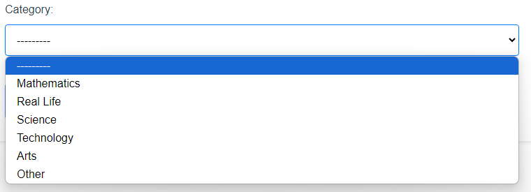
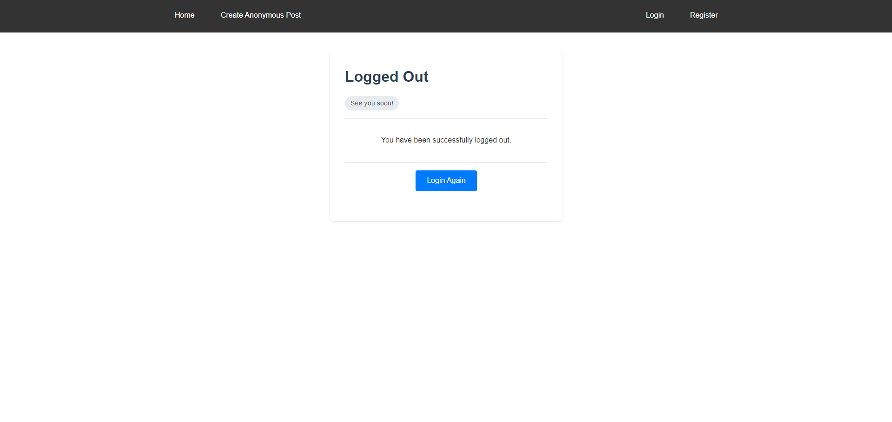

# softuni-django-project

# Project Overview
This is my SoftUni Django Project. It represents a forum, that can be used for notes managing system as well. You can search in the forum using the search bar, or you can search by category which is right next to the search bar (or you can do both). People can post stuff either anonymously or publically. If a user wants to post anonymously, the post must first go through moderation and the moderators will decide if the post can be posted. The guest users can only view anonymous posts and can comment underneath them and the comments should be approved as well. Each owner of a post has the option to edit it or delete it. If a post gets deleted, all of his comments are deleted as well. The other groups of people that can delete posts are the administrators, post moderators and comment moderators. Each one has the option to delete a post. Each user can access their profile and change their settings. The user can change his username, email and password. He can also access all of his previous posts on his profile page. He can write comments underneath his own posts and he can comment everyone else's posts. The difference between logged in user and guest is that the guest can comment only anonymous posts and their type of comment will be anonymous, while the logged in user can do a public comment under anonymous post or he can post anonymously, which will put the comment for moderation before appearing.

# Main Pages
This is the home page of the freshly loaded application without any anonymous posts.

However if there are posts, the guest will be able to see them like that:

The user has the option to create a post from the navigation bar. After clicking on "Create Anonymous Post" the anonymous post form will appear and he will be able to submit his post for moderation.

The user should choose one of the following categories before proceeding, otherwise the user cannot submit the form.

If the user wants to use the full application and see all the personal posts and well and have the option to comment underneath them, he has to either log in:

Or register:

After successful registration, the user receives a welcome message and is now able to access all the posts and create his notes.

If the user has an account and logs in, he receives a welcoming message and now can the use the full functionality of the application.

And if the user decides to log out he is asked if he is sure that he wants to log out.

If the user successfully logs out he sees the following:

The user now has the option to access his note list which is empty at first and which is strictly personal to him and no one else can access it.

The user can create his notes after clicking on "My notes" and then "Create New Note"

If the user creates some notes, the note list will start looking like this:

The user can interact with the notes. He can edit them:

Or delete them:

He now has the option to create personal posts as well.

The Home Page of the user also changes. Now it shows the personal posts as well, not only anonymous posts.

After the user creates a personal post he can view the post he created and he can also edit it:

Or delete it:

The user can now access his personal Profile.

He can also change either his username, email or password, after clicking the settings button on the Profile page.

# Admin Part

The Admin has all the functionality that the normal user has, but he has a bit of extra stuff that he can do. This is how the admin home page looks:

When the Admin clicks on "Dashboard" he will be able to view and approve or delete anonymous posts, that are submitted for approval. If there are no posts waiting for approval, the page looks like this:

However, if there are posts, it will look like this:

The admin can view the post details and decide if he will approve it or delete it.

The admin also has the option to approve or reject comments on posts. Here's how it is without comments waiting for approval:

And if there are comments, waiting for approval, it looks like this:

If the Admin approves a comment, a pop up shows that he approved the comment:

And the same goes if he reject a comment:

